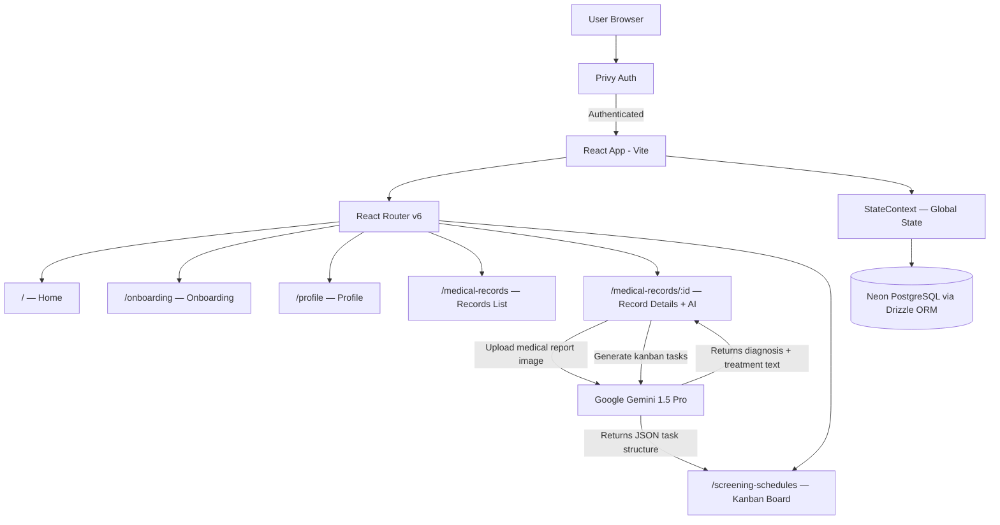
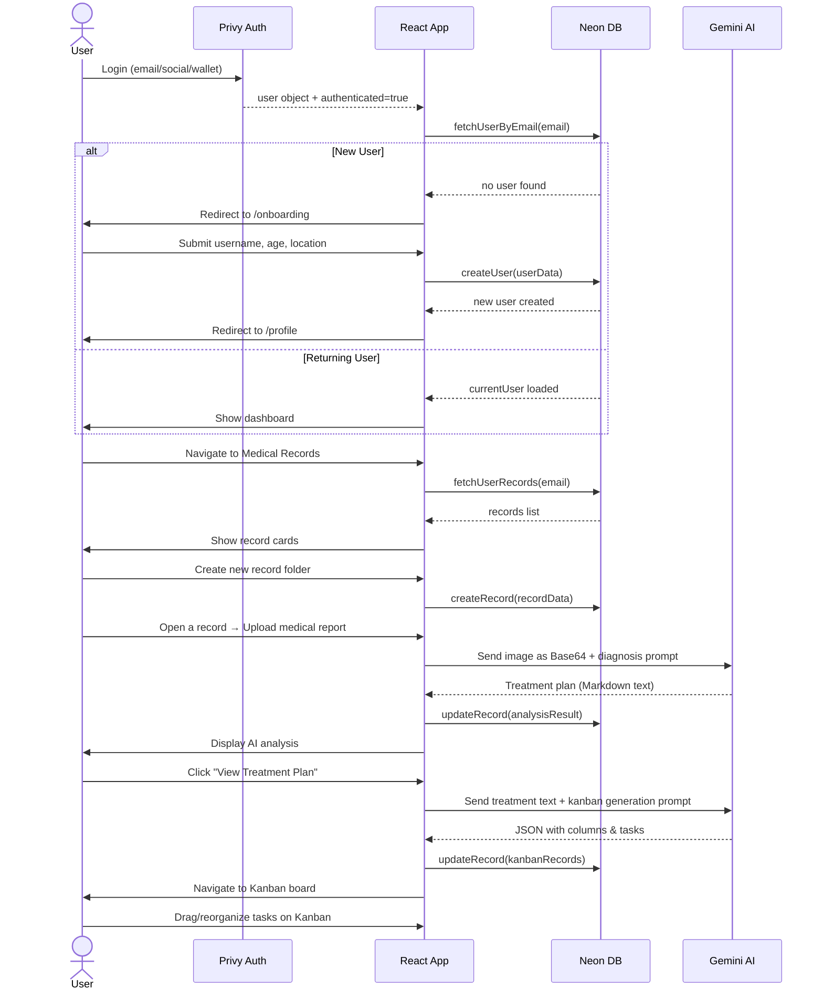

# 🏥 Healthcare AI (LifeSync) — Architecture Overview

## 🧭 What Is This Project?

**LifeSync** is a **Web3-enabled AI-powered personal healthcare management app**. It lets users:
- Securely log in via a wallet/social login (Privy)
- Store & manage medical records in a cloud database
- Upload medical reports/images and get **AI-generated diagnosis & treatment plans** via Google Gemini
- Visualize their treatment plan as an interactive **Kanban board**

---

## 🗂️ Tech Stack

| Layer | Technology |
|---|---|
| **Frontend Framework** | React 18 + Vite |
| **Routing** | React Router DOM v6 |
| **Styling** | Tailwind CSS |
| **Authentication** | Privy (`@privy-io/react-auth`) — social/email + embedded wallets |
| **Database** | Neon (serverless PostgreSQL) via Drizzle ORM |
| **AI Engine** | Google Gemini 1.5 Pro (`@google/generative-ai`) |
| **Drag & Drop** | `@dnd-kit/core` + `@dnd-kit/sortable` |
| **Icons** | `@tabler/icons-react` |
| **Markdown Rendering** | `react-markdown` |
| **Deployment** | Thirdweb (via `npx thirdweb upload dist`) |
| **DB Migration** | Drizzle Kit (`drizzle-kit push`) |

---

## 📁 Folder Structure

```
src/
├── main.jsx              ← App entry point (Privy + Router + StateContext)
├── App.jsx               ← Route definitions + auth guard
├── index.css             ← Global styles
├── Landing.jsx           ← (Landing/splash page stub)
│
├── context/
│   └── index.jsx         ← Global state & all DB operations (React Context)
│
├── utils/
│   ├── dbConfig.jsx      ← Neon DB connection + Drizzle instance
│   └── schema.jsx        ← PostgreSQL table definitions (Users, Records)
│
├── constants/
│   └── index.js          ← Navigation link config (navlinks array)
│
├── assets/
│   └── index.js          ← SVG icon exports (apps, records, screening, user, sun, menu, search, loader)
│
├── components/           ← Reusable UI components
│   ├── Navbar.jsx
│   ├── Sidebar.jsx
│   ├── CustomButton.jsx
│   ├── Loader.jsx
│   ├── MetricsCard.jsx
│   ├── DisplayInfo.jsx
│   ├── KanbanBoard.jsx
│   ├── ColumnContainer.jsx
│   ├── TaskCard.jsx
│   └── index.js
│
└── pages/                ← Route-level pages
    ├── Home.jsx
    ├── Onboarding.jsx
    ├── Profile.jsx
    ├── ScreeningSchedule.jsx
    ├── index.js
    └── records/
        ├── index.jsx                    ← Medical Records list
        ├── single-record-details.jsx    ← AI analysis + treatment
        └── components/
            ├── Modal.jsx
            ├── create-record-modal.jsx
            ├── file-upload-modal.jsx
            ├── loading-spinner.jsx
            ├── record-card.jsx
            └── record-details-header.jsx
```

---

## 🏗️ High-Level Architecture Diagram



---

## 🔐 Authentication Layer — Privy

**File:** `src/main.jsx`

Privy wraps the entire app at the root. It provides:
- **Embedded wallet creation** for users without crypto wallets
- **Social / email login** flows
- `usePrivy()` hook exposes: `user`, `authenticated`, `ready`, `login()`, `logout()`

**Auth Guard** in `App.jsx`:
```
if (ready && !authenticated) → redirect to Privy login modal
if (user && !currentUser)    → redirect to /onboarding (first-time setup)
```

---

## 🗄️ Database Layer — Neon + Drizzle ORM

**Files:** `src/utils/dbConfig.jsx` · `src/utils/schema.jsx`

### Schema

#### `users` table
| Column | Type | Notes |
|---|---|---|
| `id` | serial PK | Auto-increment |
| `username` | varchar | User's chosen name |
| `age` | integer | |
| `location` | varchar | |
| `folders` | text[] | Array of folder names |
| `folder` | text[] | Secondary folder list |
| `treatmentCounts` | integer | Number of treatments |
| `createdBy` | varchar | User's email (FK identity) |

#### `records` table
| Column | Type | Notes |
|---|---|---|
| `id` | serial PK | Auto-increment |
| `userId` | integer FK | References `users.id` |
| `recordName` | varchar | Name of the medical record folder |
| `analysisResult` | varchar | AI-generated diagnosis text |
| `kanbanRecords` | varchar | AI-generated Kanban JSON string |
| `createdBy` | varchar | Owner's email |

**DB Connection:** Neon serverless PostgreSQL (cloud), accessed directly from the browser via Drizzle ORM — **no separate backend server**.

---

## 🌐 Global State — React Context

**File:** `src/context/index.jsx`

The `StateContextProvider` holds all shared state and exposes:

| Function | What It Does |
|---|---|
| `fetchUsers()` | Fetch all users from DB |
| `fetchUserByEmail(email)` | Find and set `currentUser` by email |
| `createUser(userData)` | Insert new user row (onboarding) |
| `fetchUserRecords(email)` | Load all records for the logged-in user |
| `createRecord(recordData)` | Create a new medical record entry |
| `updateRecord(recordData)` | Update analysis result or kanban data in a record |

State variables: `users[]`, `records[]`, `currentUser`

---

## 📄 Pages & Their Responsibilities

### 1. 🏠 Home — `/`
- Dashboard landing page
- Currently a stub (`Home.jsx` is minimal)

### 2. 👋 Onboarding — `/onboarding`
- First-time user setup form
- Collects: **username**, **age**, **location**
- Calls `createUser()` → saves to DB → navigates to `/profile`

### 3. 👤 Profile — `/profile`
- Displays current user info: email, username, age, location
- Fetches via `fetchUserByEmail()` if not already loaded

### 4. 📁 Medical Records — `/medical-records`
- Lists all the user's medical record "folders" as cards
- Create new record with a name via modal → `createRecord()`
- Click a record card → navigate to `/medical-records/:id` with record data passed via React Router `state`

### 5. 🤖 Record Details + AI Analysis — `/medical-records/:id`
**This is the core AI feature page:**

**Step 1 — Upload Report**
- User opens a file upload modal
- Selects a medical image/document (PDF, image, etc.)
- File is converted to Base64

**Step 2 — AI Diagnosis (Gemini)**
```
Prompt → "You are an expert cancer and disease diagnosis analyst..."
Input  → Base64-encoded medical file
Output → Detailed treatment plan text (Markdown)
```
- Result saved to DB via `updateRecord()`
- Displayed with `react-markdown`

**Step 3 — Generate Kanban Tasks (Gemini)**
```
Prompt → Take the treatment plan and output a JSON with columns (Todo/Doing/Done) and tasks
Output → Structured JSON: { columns: [...], tasks: [...] }
```
- Saved to DB via `updateRecord()`
- Navigates to `/screening-schedules` with the parsed JSON as route state

### 6. 📋 Screening Schedules — `/screening-schedules`
- Renders the **Kanban Board** component
- Receives AI-generated columns & tasks via React Router location state

---

## 🧩 Key Reusable Components

### `Sidebar.jsx`
- Sticky vertical nav bar (desktop only)
- Icon-based navigation using `navlinks` constants
- Active state tracking

### `Navbar.jsx`
- Top bar with search input and Login/Logout button
- Mobile: collapsible drawer menu with navlinks
- Triggers `fetchUsers` + `fetchUserRecords` on auth

### `KanbanBoard.jsx`
- Drag-and-drop board powered by `@dnd-kit`
- Manages columns and tasks in local state
- Supports: create task, delete task, edit task, move task between columns, reorder columns
- Uses `DragOverlay` + React Portal for smooth drag UX

### `ColumnContainer.jsx`
- Renders a single Kanban column
- Sortable via `@dnd-kit/sortable`
- Shows task list + "Add Task" button

### `TaskCard.jsx`
- Single draggable task card
- Inline edit mode on click

### `MetricsCard.jsx` / `DisplayInfo.jsx`
- Dashboard summary/metric display components

---

## 🔄 Complete User Journey Flow



---

## ⚙️ Build & Development Scripts

| Script | Command | Purpose |
|---|---|---|
| Dev server | `yarn dev` | Run Vite dev server |
| Build | `yarn build` | Production bundle |
| Deploy | `yarn deploy` | Build + upload to Thirdweb IPFS |
| DB push | `yarn db:push` | Apply schema changes to Neon |
| DB studio | `yarn db:studio` | Open Drizzle Studio (DB GUI) |

---

## ⚠️ Notable Architecture Notes

> [!WARNING]
> **DB credentials are hardcoded** in `src/utils/dbConfig.jsx` — the Neon connection string is committed directly in source code. This is a security risk; it should be moved to environment variables (`VITE_DATABASE_URL`).

> [!NOTE]
> **No backend server** — all database queries run directly from the browser using Neon's serverless HTTP driver. This is possible because Neon supports HTTP-based queries, but it means DB credentials are exposed client-side.

> [!NOTE]
> **Gemini API key** is loaded from `import.meta.env.VITE_GEMINI_API_KEY` — this should be in a `.env` file (not committed to git).

> [!TIP]
> The `kanbanRecords` field stores the AI-generated kanban JSON as a raw string in the DB. This means re-entering a record detail page always shows the previously generated plan (if it exists), since `analysisResult` is pre-loaded from `state.analysisResult`.
